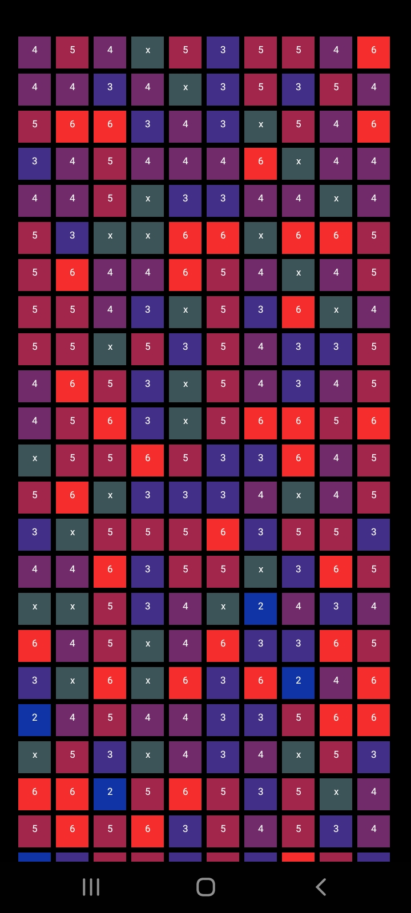

# Wordl: A Wordle-like game for Android

### About
I made this because I really like solving the NYT's Wordle game but don't want to have to do one per day. I also wanted to add more features, such as the option to play four or six letter games as opposed to the standard five.

### Development
This app was developed in Android Studio and coded in Java.

### Installation
Download wordl.apk from this repository onto your Android and open it to install it. You may need to go to your Settings to allow permission for the app to be installed. **Note. This app must be played in Dark mode.**

### Resources
For the words for the five letter game, I used this wordlist (I removed a few):

https://github.com/charlesreid1/five-letter-words/blob/master/sgb-words.txt

For the words for the four and six letter games, I used this wordlist:

https://github.com/first20hours/google-10000-english/blob/master/google-10000-english-usa.txt

For the graphing features, I used this library:

https://github.com/PhilJay/MPAndroidChart

# The App

### How to Play
Type in a word and press GO to guess a word. Letters in the correct place are blue; letters that are in the word but not in the correct place are yellow; letters not in the word are grey. Earn points by guessing in as few guesses as you can. Your score resets to 0 if you run out of guesses. Pressing CLEAR will clear the board and start a new game. **Pressing CLEAR before you guess the word will reset your Score to 0.**

### Score
You accumulate points by guessing words correctly. If you run out of guesses without guessing correctly, the score resets to 0. You can see your highest score in STATS. Scores for four, five, six letter games are independent.

Because the wordlists are (somewhat) arranged by word commonness, a word further down in the wordlist has a higher points score. For every incorrect guess, the point you will earn decreases by 15 percent. You get a bonus 5000 points for guessing in the first try, and 3000 for the second try.

### About Word Lists
The wordlist for the five letter games is pretty robust, but the wordlists for the four and six letter games are less so. For each category of games, you may try to guess a common word that gets rejected because it is not on the wordlist. I will soon make the word bank more robust.

## Five Letter Game

* Stats: View a bar chart of the games won for five letter games.
* History: View the game history "mosaic." (NEW)
* Four Letter Game: Launch a four letter game.
* Six Letter Game: Launch a six letter game.

## Stats - Five Letter Game

This graph shows the number of games you've won by the number of guesses it took. It also shows the number of losses.

* High Score - The highest amount of points you've earned for a five letter game.
* Total Games Played - The total number of games you've played for a five letter game.

## History ("Mosaic") - Five Letter Game

This is a work in progress. This is a grid that shows the game history: each square is a game you have played, colored by how many guesses (or grey if the game was lost). The grid is in order of left to right, top to bottom. In the order of 1 through 6 guesses, the colors of the squares are blue, green, yellow, yellow-orange, orange, red. I will add a header/title to this page and likely a "key" as well (similar to the one on the graph page.

# Features Still Needed

I still need to program the History Mosaics for four and six letter games. Furthermore, the History screens need some labels.
